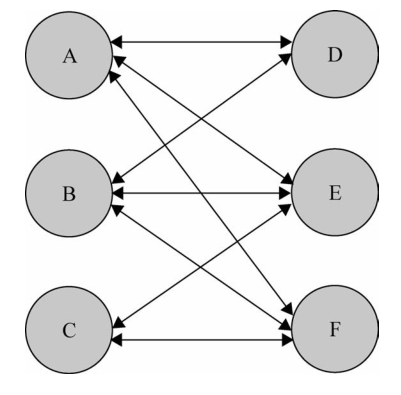
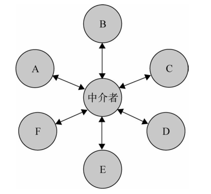

## JS设计模式之中介者模式 ##
### 中介
对于中介大家想必非常了解。中介也始终贯穿在每个人的生活中。比如买房有房产中介，找保姆有家政公司，农村到现在都还存在的牛经济等。虽然，每个人都被黑中介给黑过。当不可否认的是，中介确实给大家的生活带来了很大的便利。想象一下，如果买房者都去自己收集信息，了解房子周边区域，与所有的卖方谈判会花费极大的精力。有了房产中介，我们不需要自己去收集所有的信息，我们只需要通过中介去了解就可以了，这所有的工作中介都帮我们代劳了。
### 中介者模式
具体到js coding也一样。js做为一门面向对象的编程语言，我们的程序中会存在许许多多的对象、模块。如果各个对象模块之间的关系成网状交织，那么我们的代码将变得不可维护。聪明的程序猿必然不会允许这种情况的泛滥，于是他们发明了中介者模式：
> 中介者模式的作用就是解除对象与对象之间的紧耦合关系。增加一个中介者对象后，所有的
相关对象都通过中介者对象来通信，而不是互相引用，所以当一个对象发生改变时，只需要通知
中介者对象即可。中介者使各对象之间耦合松散，而且可以独立地改变它们之间的交互。中介者模式使网状的多对多关系变成了相对简单的一对多关系。



 *图1.对象之间多对多的关系*

基于中介者模式的设计思路，我们将多对多的关系变成了一对多的关系：


 *图2.对象之间多对多的关系*


### 代码示例
假设有一个搬家用车的场景，页面上有个选择车型的select，用车的数量的input，实时价格的计算和一个提交按钮。代码如下：
```
<!DOCTYPE html>
<html lang="en">
    <head>
        <title>koa home page</title>
        <meta charset="UTF-8">
        <meta name="viewport" content="width=device-width, initial-scale=1">
        <style>
            .formItem{
                line-height: 3;
            }
            .outputArea{
                line-height: 3;
                border-top: 1px solid #ccc;
            }
        </style>
    </head>
    <body>
        <div class="inputArea">
            <div class="formItem">
                <label for="">选择车型：</label>
                <select name="carType" id="carType">
                    <option value="0">选车型</option>
                    <option value="1">小面</option>
                    <option value="2">金杯</option>
                    <option value="3">箱货</option>
                </select>
            </div>
            <div class="formItem">
                <label for="">用车数量：</label>
                <input type="number" name="num" id="num" value="">
            </div>
            <button id='submit' disabled>下一步</button>
        </div>
        <div id="cost" class="outputArea" disabled>您需要支付：0元</div>
        <script>
            var carType = document.querySelector('#carType');
            var num = document.querySelector('#num');
            var cost = document.querySelector('#cost');
            var submit = document.querySelector('#submit');
            var price = [0, 50, 80, 100]
            function onChangeNum(){
                var typeValue = Number(carType.options[carType.selectedIndex].value);
                var numValue = Number(num.value);
                if(!typeValue) {
                    submit.innerHTML = '请选择车型'
                    submit.setAttribute('disabled','disabled')
                    return
                }
                if(!numValue) {
                    submit.innerHTML = '请填写用车数'
                    submit.setAttribute('disabled','disabled')
                    return 
                }
                cost.innerHTML = '您需要支付' + price[typeValue] * numValue + '元'
                submit.innerHTML = '下一步'
                submit.removeAttribute('disabled')
            }
            function onChangeType(){
                var typeValue = Number(carType.options[carType.selectedIndex].value);
                var numValue = Number(num.value);
                if(!typeValue) {
                    submit.innerHTML = '请选择车型'
                    submit.setAttribute('disabled','disabled')
                    return 
                }
                if(!numValue) {
                    submit.innerHTML = '请填写用车数'
                    submit.setAttribute('disabled','disabled')
                    return 
                }
                cost.innerHTML = '您需要支付' + price[typeValue] * numValue + '元'
                submit.innerHTML = '下一步'
                submit.removeAttribute('disabled');
            }
            carType.addEventListener('change', onChangeType, false);
            num.addEventListener('input', onChangeNum, false);
        </script>
    </body>
</html>
```

为了演示中介者模式的优点，写出如上代码着实也挺吃力的。其实，绝大多数人是写不出这样的代码的。我们可以明显感受到这段代码的缺点：**耦合性太强**。
下面我们基于中介者的设计思想，来进行一个简单的改造：

```
var carType = document.querySelector('#carType');
var num = document.querySelector('#num');
var cost = document.querySelector('#cost');
var submit = document.querySelector('#submit');
var mediator = (function(){
var price = [0, 50, 80, 100]
function change() {
		var typeValue = Number(carType.options[carType.selectedIndex].value);
        var numValue = Number(num.value);
        if(!typeValue) {
           submit.innerHTML = '请选择车型'
           cost.innerHTML = '您需要支付：0元'
           submit.setAttribute('disabled','disabled')
           return
        }
        if(!numValue) {
           submit.innerHTML = '请填写用车数'
           cost.innerHTML = '您需要支付：0元'
           submit.setAttribute('disabled','disabled')
           return
        }
        cost.innerHTML = '您需要支付' + price[typeValue] * numValue + '元'
        submit.innerHTML = '下一步'
        submit.removeAttribute('disabled')
     }
     return {
        change: change
     }
})();

function onChangeNum(){
	mediator.change()
}
function onChangeType(){
	mediator.change()
}
carType.addEventListener('change', onChangeType, false);
num.addEventListener('input', onChangeNum, false);
```
改进之后的代码，我们将车型、用车数量、实时费用、按钮状态之间的关系通过一个mediator对象来统一管理，每个元素的只需要完成自己的逻辑即可，其他的事情都交由mediator去处理。代码的可维护性和扩展性都得到了增强。
### 总结
中介者模式通过一个中间者对象模块或者方法，将对象、方法之间多对多的关系转换成一对多的关系，对开发者来说可以很好的提高代码的可维护性和扩展性。但任何事情都是相对的，当对象非常多，且相互之间的关系变得错综复杂时，中介者模式无非是将处理逻辑转移到了中介者来处理。中介者本身也将变得极难维护。所以我的最佳实践是**一切根据实际情况来决定，不要为了设计模式而设计模式**


